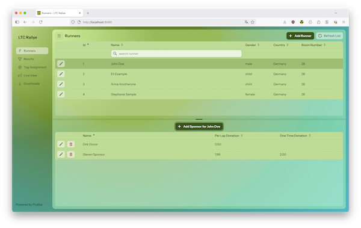
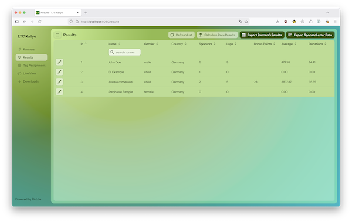
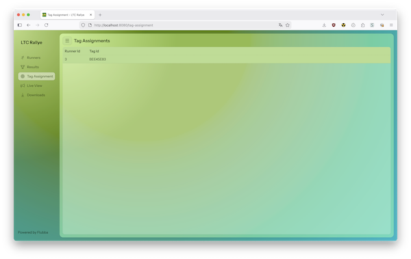
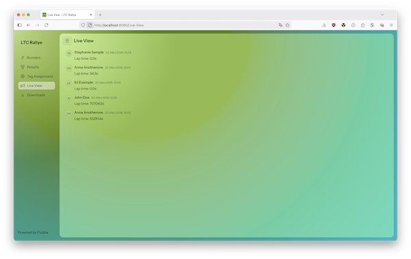
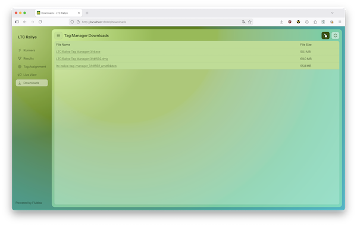

# LTC Rallye

**LTC Rallye** is a comprehensive web application for managing sponsor-based running rallies/races with real-time NFC/RFID lap tracking. Built with Vaadin (Java) and Spring Boot, it provides an end-to-end solution for organizing charity running events where sponsors donate money per lap completed by runners.

[](docs/runners_view.png)

## What is it?

LTC Rallye is designed for charity running events where:
- **Runners** complete laps around a track
- **Sponsors** pledge donations either per lap or as one-time contributions
- **Organizers** track laps in real-time using NFC/RFID tags and readers
- **Results** are automatically calculated and exported for reporting

The system consists of two components:
1. **LTC Rallye** (this application) - Web-based management and tracking system
2. **Tag Manager** (companion desktop app) - Desktop application for configuring NFC tag readers and assigning tags to runners - [also on Github](https://github.com/waschmittel/ltc-rally-tagmanager)

## Features

- **Runner Management**: Register and manage runners with room numbers, bonus points, and statistics
- **Sponsor Management**: Track sponsors, their donations (per-lap and one-time), and link them to runners
- **Real-time Lap Tracking**: Integration with RFID tag readers to automatically record lap times
- **Live View**: Real-time display of runners completing laps with lap times
- **Results Calculation**: Automatic calculation of runner statistics (fastest lap, average lap time, total laps)
- **Tag Assignment**: View and manage RFID tag assignments to runners
- **Excel Export**: Export runner results and sponsor letter data for external processing
- **File Downloads**: Access to Tag Manager desktop applications for various platforms

## How to Use

### Prerequisites

- Java 25 or higher
- PostgreSQL database
- Maven
- RFID tag reader hardware

### Setup

1. **Database Setup**: Run PostgreSQL (you can use the provided Docker script):
   ```bash
   ./run_postgres_in_docker.sh
   ```

2. **Build and Run**:
   ```bash
   mvn clean install
   mvn spring-boot:run
   ```

   Or use the build script:
   ```bash
   ./build.sh
   ```

3. **Access the Application**: Open your browser and navigate to `http://localhost:8080`

### Using the Application

#### 1. Runners View
- **Add Runners**: Click "Add Runner" to register new participants with name, room number, and gender
- **Add Sponsors**: Select a runner and click "Add Sponsor for [Runner Name]" to add their sponsors with donation amounts
- **Edit/Delete**: Use the edit/delete buttons in the grid to modify or remove entries
- **Refresh**: Click refresh to update the data from the database

#### 2. Results View
- **View Results**: See all runners with their statistics (total laps, fastest lap, average time, bonus points)
- **Calculate**: Click "Calculate" to recalculate all runner statistics
- **Export**:
  - "Export Runner's Results" - Download Excel file with runner performance data
  - "Export Sponsor Letter Data" - Download Excel file with sponsor donation calculations

#### 3. Tag Assignment View
- View which RFID tags are assigned to which runners
- Useful for troubleshooting tag reader issues

#### 4. Live View
- Real-time feed of runners completing laps
- Shows runner name and lap time as they cross the finish line
- Updates automatically via push notifications

#### 5. Downloads
- Download the Tag Manager desktop application for Windows, macOS, or Linux
- Tag Manager is used to configure and test RFID tag readers

### NFC/RFID Tag Integration

The application integrates with NFC smartcard readers (tested with ACR122U) to automatically track laps:

1. **Setup**: Use the Tag Manager desktop application to:
   - Configure and test your NFC reader hardware
   - Assign NFC tags to runner numbers

2. **Operation**: The web application:
   - Discovers tag readers on the local network using mDNS service discovery
   - Receives lap notifications via REST API when a tag is scanned
   - Automatically records lap time, updates statistics, and broadcasts to Live View

3. **Tag Manager Downloads**: Available from the Downloads view for Windows, macOS, and Linux

**Note**: On Linux, the ACR122U reader requires driver installation. See the Tag Manager README for setup instructions.

## Screenshots

### Runners View
[](docs/runners_view.png)

### Results View
[](docs/results_view.png)

### Tag Assignments View
[](docs/tag_assignments_view.png)

### Live View
[](docs/live_view.png)

### Client Download View
[](docs/client_download_view.png)

## Technology Stack

- **Backend**: Java 25, Spring Boot, JPA/Hibernate
- **Frontend**: Vaadin Flow (Java-based UI framework)
- **Database**: PostgreSQL
- **Build**: Maven
- **NFC Integration**: REST API + mDNS service discovery
